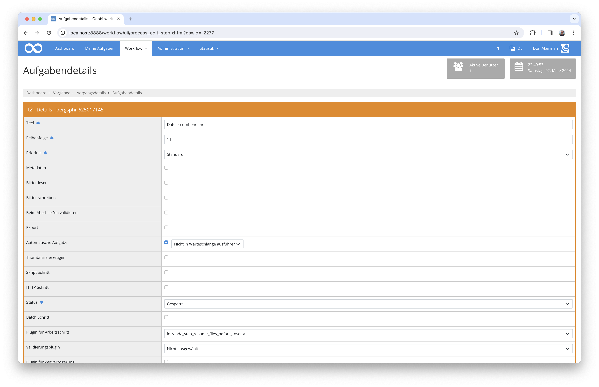

# Umbenennung von Dateien vor dem Rosetta-Ingest

## Einführung

Dieses Plugin dient der bedingten Umbenennung von Dateien innerhalb der Medien- und OCR-Verzeichnissen eines Vorgangs innerhalb von Goobi workflow. Die Benennung erfolgt in Abhängigkeit vom Vorgangstitel und einem konfigurierbaren Format.

## Übersicht

| Details |  |
| :--- | :--- |
| Identifier | intranda\_step\_rename\_files\_before\_rosetta |
| Source code | [https://github.com/intranda/goobi-plugin-step-rename-files-before-rosetta](https://github.com/intranda/goobi-plugin-step-rename-files-before-rosetta) |
| Lizenz | GPL 2.0 oder neuer |
| Dokumentationsdatum | 27.04.2023 |

## Installation

Zur Installation des Plugins muss die folgende Datei installiert werden:

```bash
/opt/digiverso/goobi/plugins/step/plugin_intranda_step_rename_files_before_rosetta.jar
```

Um zu konfigurieren, wie sich das Plugin verhalten soll, können verschiedene Werte in der Konfigurationsdatei angepasst werden. Die Konfigurationsdatei befindet sich üblicherweise hier:

```bash
/opt/digiverso/goobi/config/plugin_intranda_step_rename_files_before_rosetta.xml
```

Dabei sieht der Inhalt dieser Konfigurationsdatei beispielhaft wie folgt aus:

```xml
<config_plugin>
    <!--
        order of configuration is:
          1.) project name and step name matches
          2.) step name matches and project is *
          3.) project name matches and step name is *
          4.) project name and step name are *
	-->
    
    <config>
        <!-- which projects to use for (can be more then one, otherwise use *) -->
        <project>*</project>
        <step>*</step>
        
        <!-- format that should be used to create new names -->
        <!-- expected here is a string consisting of only 0s, and if it's not set, then the DEFAULT setting 0000 will be used-->
        <format>0000</format>
    </config>

</config_plugin>
```

## Allgemeine Konfiguration des Plugins

Die Konfiguration des Plugins erfolgt innerhalb der bereits erwähnten Konfigurationsdatei. Dort können verschiedene Parameter konfiguriert werden. Der Block `<config>` kann für verschiedene Projekte oder Arbeitsschritte wiederholt vorkommen, um innerhalb verschiedener Workflows unterschiedliche Aktionen durchführen zu können. Die Elemente `<format>` sind hierbei maßgeblich für die Generierung der Dateinamen.

| Wert | Beschreibungen |
| :--- | :--- |
| `project` | Dieser Parameter bestimmt das Projekt, für das der aktuelle Block `<config>` gelten soll. Hier wird der Name des Projekts verwendet. Dieser Parameter kann mehrmals pro `<config>`-Block vorkommen. |
| `step` | Dieser Parameter steuert, für welche Arbeitsschritte der Block `<config>` gelten soll. Hier wird der Name des Arbeitsschrittes verwendet. Dieser Parameter kann mehrmals pro `<config>`-Block vorkommen. |
| `format`  | Mit diesem Parameter kann der Benutzer die Anzahl der Ziffern festlegen, die zur Formatierung der Reihenfolge der Dateien unter allen Dateien als Teil ihres neuen Namens verwendet werden sollen. Wenn dieser Parameter nicht gesetzt ist oder fehlt, wird standardmäßig `0000` verwendet. |

## Arbeitsweise

Das Plugin wird üblicherweise vollautomatisch innerhalb des Workflows ausgeführt: 

Es ermittelt zunächst, ob sich innerhalb der Konfigurationsdatei ein Block befindet, der für den aktuellen Workflow bzgl. des Projektnamens und Arbeitsschrittes konfiguriert wurde. 

Wenn dies der Fall ist, benennt das Plugin alle Dateien aus den entsprechenden Ordnern nach dem Format `{Hinterer Teil des Vorgangstitels nach dem ersten _ }_{formatierte Reihenfolge der Datei in diesem Ordner}` um.

Im Anschluß daran wird die METS-Datei aktualisiert, um sicherzustellen, dass Goobi workflow und Rosetta weiterhin mit den aktualisierten Informationen arbeiten können.

Das Plugin berücksichtigt für die Benennung die Dateien innerhalb der folgenden Unterverzeichnisse:

* media
* alto
* pdf
* txt
* xml

## Bedienung des Plugins

Dieses Plugin wird in den Workflow so integriert, dass es automatisch ausgeführt wird. Eine manuelle Interaktion mit dem Plugin ist nicht notwendig. Zur Verwendung innerhalb eines Arbeitsschrittes des Workflows sollte es wie im nachfolgenden Screenshot konfiguriert werden.


